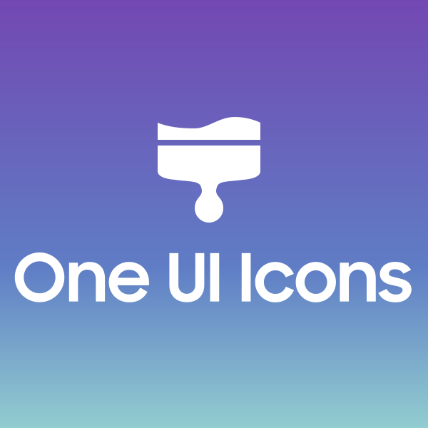
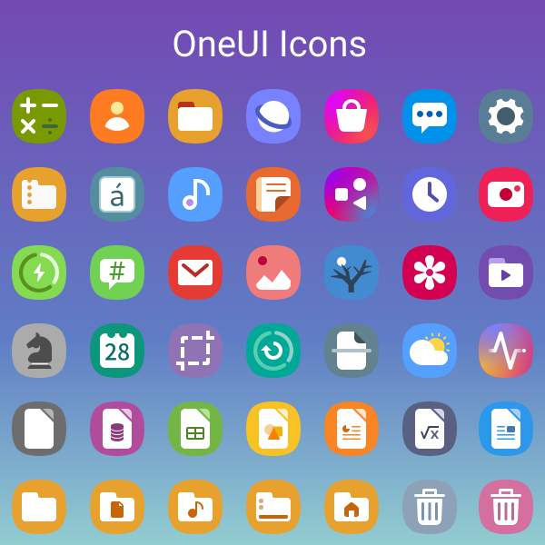
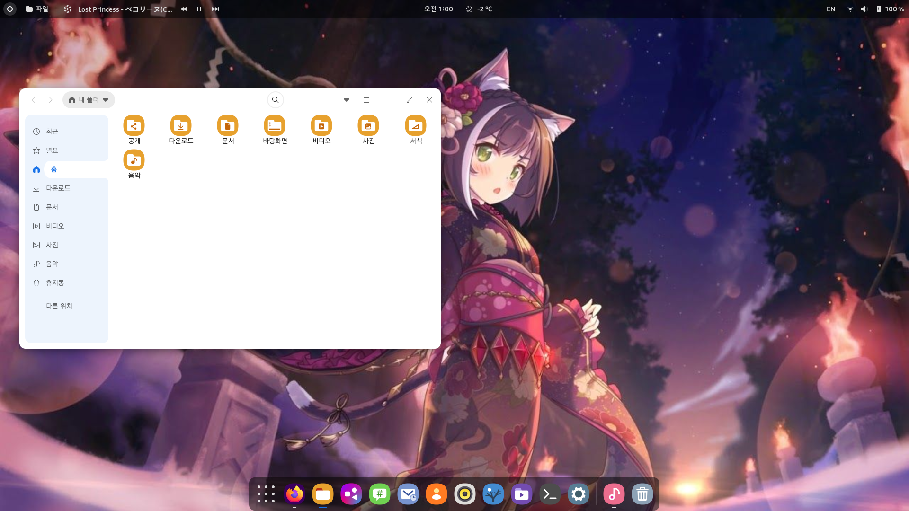
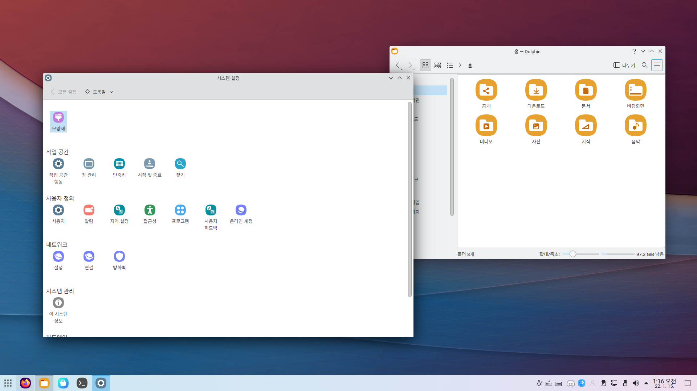
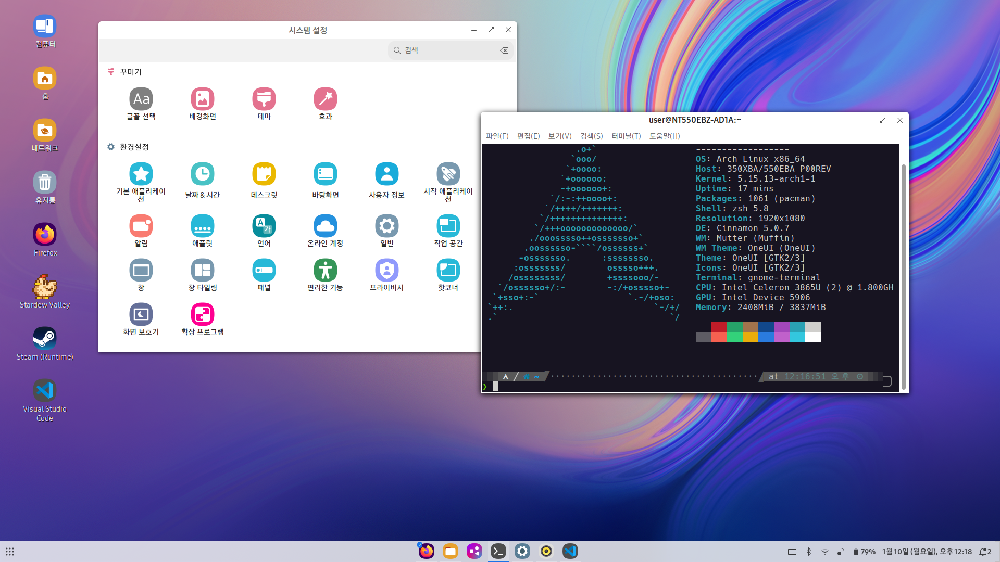
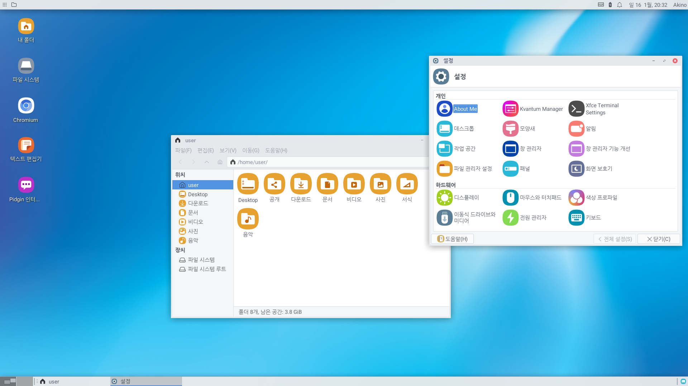

# OneUI4-Icons

Succeeded project for OneUI

# Based On
* [Fluent-icon-theme by vinceliuice](https://github.com/vinceliuice/Fluent-icon-theme)

# Preview

# Sample
*  GNOME

*  KDE

*  Cinnamon

*  Xfce

# Migration to OneUI-Icons
